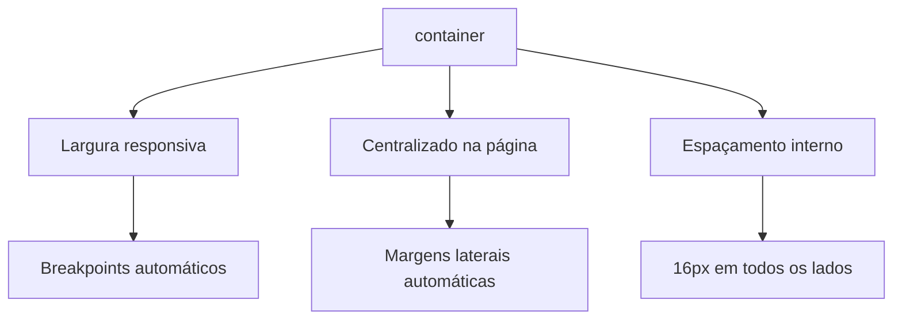

# Notas de aula - React - Compartilhando dados entre componentes e introdução a Tailwindcss

## Informações gerais
- **Objetivo**: mostrar os conceitos básicos de React
- **Público alvo**: alunos da disciplina de POS (Programação Orientada a Serviços) do curso de Infoweb (Técnico Integrado em Informática para Internet) no CNAT-IFRN (Instituto Federal de Educação, Ciência e Tecnologia do Rio Grande do Norte - Campus Natal-Central)
- **Professor**: [L A Minora](https://github.com/leonardo-minora/)
- **Aluno**: FIXME


## Pré-requisitos
1. Conta ativa no Github (todos nossos projetos serão via github)
2. Ter realizado e compreendido a aula/atividade de [conceitos básicos de react](https://github.com/infoweb-pos/2025-pos-react-conceitos)


## Links
- React - Compartilhando conceitos entre componentes
  - [Quick start](https://react.dev/learn)
  - [Sharing state between components](https://react.dev/learn/sharing-state-between-components)
- [Tailwindcss](https://tailwindcss.com/)
  - [Documentation](https://tailwindcss.com/docs/)


## Sumário

1. Introdução a [tailwindcss](https://tailwindcss.com/)
2. Compartilhando dados entre componentes React com _state_ e _props_
3. Codar para compartilhar dados


## Parte 1. Introdução a [tailwindcss](https://tailwindcss.com/)
Esta parte foi construído com auxílio do [deepseek](https://chat.deepseek.com/)


### 1.1. O que é Tailwind CSS?
Tailwind CSS é um framework CSS utilitário que permite construir designs rapidamente usando classes pré-definidas diretamente no seu HTML/JSX. Diferente de frameworks como Bootstrap, Tailwind não oferece componentes prontos, mas sim classes de baixo nível para criar designs customizados.

**Observação**: os  nossos projetos de sala de aula são React/Next/Typescript e já estão configurados com o tailwindcss.

### 1.2. Análise do código fornecido

#### 1.2.1. Componente `Titulo`
```jsx
const Titulo = () => (
	<h1 className="text-2xl font-bold mb-1">React - Conceitos básicos</h1>
);

```

Aqui está a análise by [deepseek](https://chat.deepseek.com/) das classes Tailwind CSS utilizadas no componente `Titulo`:

```jsx
<h1 className="text-2xl font-bold mb-1">React - Conceitos básicos</h1>
```

**Classes Tailwind CSS explicadas:**

1. **`text-2xl`**  
   - Define o tamanho do texto como **2xl** (extra large)  
   - Equivale a **1.5rem** ou **24px**  
   - Segue a escala de tamanhos do Tailwind: `xs`, `sm`, `base`, `lg`, `xl`, `2xl` até `9xl`
2. **`font-bold`**  
   - Aplica o peso da fonte como **bold** (negrito)  
   - Corresponde a **font-weight: 700** no CSS tradicional  
   - Outras variações disponíveis: `font-light`, `font-normal`, `font-semibold`, `font-extrabold`
3. **`mb-1`**  
   - Adiciona uma **margin-bottom** de tamanho **1**  
   - Na escala do Tailwind: **0.25rem** ou **4px**  
   - Equivalente a `margin-bottom: 0.25rem`  
   - O número 1 representa a unidade base (0.25rem), onde:  
     - `mb-2` = 0.5rem (8px)  
     - `mb-4` = 1rem (16px)  
     - etc.

**Efeito visual combinado:**
Essas classes trabalham juntas para criar:
- Um cabeçalho de destaque (h1) com tamanho aumentado
- Texto em negrito para maior ênfase
- Espaçamento inferior controlado para separação do conteúdo seguinte


**Comparação com CSS tradicional abaixo**
```css
h1 {
  font-size: 1.5rem;    /* 24px */
  font-weight: 700;     /* bold */
  margin-bottom: 0.25rem; /* 4px */
}
```

**Quando usar este padrão:**
- Para títulos principais de seções
- Quando precisa de hierarquia visual clara
- Em componentes que devem manter consistência tipográfica
- Como parte de um sistema de design escalável

Este é um padrão típico para componentes de título em aplicações React com Tailwind, combinando tipografia e espaçamento de forma eficiente.


#### 1.2.2. Componente `SubTitulo`
```jsx

const SubTitulo = () => (
	<h2 className="text-4xl font-bold mb-6">Lista de tarefas</h2>
);

```

Aqui está a análise by [deepseek](https://chat.deepseek.com/) das classes Tailwind CSS no componente `SubTitulo`:

```jsx
<h2 className="text-4xl font-bold mb-6">Lista de tarefas</h2>
```

**Classes Tailwind CSS explicadas:**

1. **`text-4xl`**
   - Tamanho de texto extra grande (4 extra large)
   - Equivale a **2.25rem** ou **36px**
   - Um tamanho acima do `text-3xl` (1.875rem) e abaixo do `text-5xl` (3rem)
   - Ideal para títulos principais/destaques
2. **`font-bold`**
   - Peso de fonte negrito (700)
   - Mesma classe usada no `Titulo`, mantendo consistência
   - Diferencia de textos normais (400) ou semibold (600)
3. **`mb-6`**
   - Margin-bottom de 1.5rem (24px)
   - Espaçamento 50% maior que o `mb-4` (1rem/16px)
   - Na escala Tailwind: 6 × 0.25rem = 1.5rem
   - Cria um espaçamento generoso abaixo do subtítulo

**Hierarquia visual criada:**
```html
<h1 className="text-2xl...">React - Conceitos básicos</h1>  <!-- 24px -->
<h2 className="text-4xl...">Lista de tarefas</h2>          <!-- 36px -->
```
- O subtítulo é propositalmente maior que o título (36px vs 24px)
- Isso inverte a hierarquia tradicional (onde h1 > h2)
- Sugere que "Lista de tarefas" é o foco principal neste contexto

**Comparação com CSS tradicional:**
```css
h2 {
  font-size: 2.25rem;   /* 36px */
  font-weight: 700;     /* bold */
  margin-bottom: 1.5rem; /* 24px */
}
```

**Boas práticas observadas:**
1. **Escala tipográfica** - Usa a escala padrão do Tailwind (4xl)
2. **Consistência** - Mantém `font-bold` igual ao título principal
3. **Espaçamento intencional** - `mb-6` cria um "ar" visual abaixo do elemento
4. **Contraste hierárquico** - Diferencia-se claramente de outros textos

**Quando usar este padrão:**
- Como cabeçalho de seções importantes
- Quando precisa chamar mais atenção que um título convencional
- Em landing pages ou elementos que requerem forte destaque
- Em combinação com textos menores para criar contraste

Esta implementação mostra um uso estratégico do Tailwind para criar ênfase visual, indo além da hierarquia HTML tradicional quando o design requer.


#### 1.2.3. Componente `Cabecalho`
```jsx
function Cabecalho() {
	return (
		<div className="text-center">
			<Titulo />
			<SubTitulo />
		</div>
	);
}

```

Aqui está a análise by [deepseek](https://chat.deepseek.com/) das classes Tailwind CSS no componente `Cabecalho`


**Classe Tailwind CSS explicada:**

1. **`text-center`**
   - Alinha o texto dos elementos filhos ao **centro horizontal**
   - Equivalente CSS: `text-align: center`
   - Aplica-se a todos os elementos de texto dentro da div (incluindo os componentes Titulo e SubTitulo)

**Comportamento específico neste contexto:**

- **Herança de alinhamento**:
  - O alinhamento central afeta tanto o `<h1>` (Titulo) quanto o `<h2>` (SubTitulo)
  - Mesmo sendo componentes separados, herdam o `text-center` do container pai
- **Combinação com outros estilos**:
  - Não sobrescreve as classes internas dos componentes (`text-2xl`, `text-4xl`, etc.)
  - Complementa os estilos existentes apenas com o alinhamento

**Comparação com CSS tradicional:**
```css
.cabecalho {
  text-align: center;
}
```

**Efeitos visuais criados:**

1. **Organização espacial**:
   - Centraliza todo o cabeçalho na página
   - Cria um eixo visual claro para o conteúdo
2. **Hierarquia mantida**:
   - Preserva os tamanhos de fonte originais (24px e 36px)
   - Mantém os espaçamentos definidos (`mb-1` e `mb-6`)
3. **Responsividade implícita**:
   - O alinhamento central se adapta a qualquer largura de tela
   - Funciona bem em dispositivos móveis

**Boas práticas observadas:**

1. **Controle no elemento pai**:
   - Centralização aplicada no container em vez de em cada elemento filho
   - Evita repetição de código
2. **Composição de componentes**:
   - Mostra como classes Tailwind podem trabalhar em conjunto com componentes React
   - Estilos globais (container) + estilos específicos (componentes)
3. **Manutenção simplificada**:
   - Mudar o alinhamento requer ajuste em apenas um lugar

**Quando usar este padrão:**

- Para cabeçalhos de páginas ou seções
- Em elementos que precisam de focalização central
- Como wrapper para grupos de componentes que devem compartilhar alinhamento
- Em combinação com outros utilitários como `mx-auto` para centralização completa

Este padrão demonstra eficiência no uso do Tailwind, aplicando uma única classe utilitária para controlar o layout de múltiplos componentes filhos.


#### 1.2.4. Componente `Tarefa`
```jsx
const Tarefa: React.FC<TarefaProps> = ({ titulo, concluido }) => {
	const [estaConcluido, setEstaConcluido] = useState(concluido);

	const classe = `p-3 mb-3 rounded-lg shadow-md hover:cursor-pointer hover:border ${
		estaConcluido
			? "bg-gray-800 hover:border-gray-800"
			: "bg-gray-400 hover:border-gray-400"
	}`;

	const escutarClique = () => {
		console.log(`A tarefa '${titulo}' foi clicada!`);
		setEstaConcluido(!estaConcluido);
	};

	return (
		<div className={classe} onClick={() => escutarClique()}>
			<h3 className="text-xl font-bold">{titulo}</h3>
			<p className="text-sm">{estaConcluido ? "Concluída" : "Pendente"}</p>
		</div>
	);
};

```

Aqui está a análise by [deepseek](https://chat.deepseek.com/) das classes Tailwind CSS no componente `Tarefa`:

**Classes base (aplicadas sempre)** na variável `classe`.
```js
`p-3 mb-3 rounded-lg shadow-md hover:cursor-pointer hover:border`
```

1. **`p-3`**
   - Padding de 0.75rem (12px) em todos os lados
   - Espaçamento interno equilibrado para o conteúdo
2. **`mb-3`**
   - Margin-bottom de 0.75rem (12px)
   - Espaçamento entre tarefas na lista
3. **`rounded-lg`**
   - Bordas arredondadas (border-radius de 0.5rem/8px)
   - Estilo moderno e amigável
4. **`shadow-md`**  
   - Sombra média (elevação visual)  
   - depth: 0 4px 6px -1px rgb(0 0 0 / 0.1)
5. **`hover:cursor-pointer`**
   - Muda cursor para pointer (mãozinha) no hover
   - Indica elemento clicável
6. **`hover:border`**
   - Adiciona borda no hover (1px solid)
   - Efeito visual de interatividade

**Classes Condicionais por estado** a ser avaliado em `estaConcluido`.
```js
${estaConcluido ? "bg-gray-800 hover:border-gray-800" : "bg-gray-400 hover:border-gray-400"}
```

**Estado concluído (true)**:
- `bg-gray-800`  
  - Fundo cinza escuro (#1f2937)  
  - Indica conclusão visualmente
- `hover:border-gray-800`  
  - Bordas cinza escuras no hover

**Estado pendente (false)**:
- `bg-gray-400`  
  - Fundo cinza claro (#9ca3af)  
  - Diferencia tarefas não concluídas
- `hover:border-gray-400`  
  - Bordas cinza claras no hover

Classes do conteúdo interno aplicados a `h3` (título da tarefa) e `p` (estado da tarefa)
```jsx
<h3 className="text-xl font-bold">
<p className="text-sm">
```

1. **Título (h3)**:
   - `text-xl` - Tamanho 1.25rem/20px
   - `font-bold` - Negrito (700)
2. **Status (p)**:
   - `text-sm` - Tamanho 0.875rem/14px  
   - Contraste proposital com o título

Análise de design system
1. **Hierarquia Visual**:
   - Título em `text-xl` vs estado em `text-sm`
   - Uso de peso `bold` para o título
2. **Feedback Visual**:
   - Cores diferentes por estado (gray-400/800)
   - Efeitos hover consistentes
3. **Acessibilidade**:
   - Contraste adequado (gray-800 sobre fundo escuro)
   - Espaçamento claro entre elementos

Funcionamento dinâmico com transição de estados
```js
  bg-gray-400 ↔ bg-gray-800
  hover:border-gray-400 ↔ hover:border-gray-800
```
- Mudança visual imediata ao concluir/desfazer

**Comparação CSS tradicional:**
```css
.tarefa {
  padding: 0.75rem;
  margin-bottom: 0.75rem;
  border-radius: 0.5rem;
  box-shadow: 0 4px 6px -1px rgba(0,0,0,0.1);
  cursor: pointer;
}

.tarefa:hover {
  border: 1px solid;
}

.tarefa-concluida {
  background-color: #1f2937;
}

.tarefa-concluida:hover {
  border-color: #1f2937;
}

/* ... */
```

**Melhorias potenciais:**
1. **Transições Suaves**:
   ```js
   transition-colors duration-200
   ```
2. **Dark Mode**:
   ```js
   dark:bg-gray-700 dark:hover:border-gray-700
   ```
3. **Foco Acessível**:
   ```js
   focus:ring-2 focus:ring-blue-500
   ```

**Este componente demonstra excelente uso do Tailwind CSS para:**
- Estados dinâmicos (condicionais)
- Interatividade (hover)
- Hierarquia visual
- Design responsivo


#### 1.2.4. Componente `Tarefa`
```jsx
const Home = () => {
	const tarefas = [
		{ id: 1, title: "delectus aut autem", completed: false },
		{ id: 2, title: "quis ut nam facilis et officia qui", completed: true },
		{ id: 3, title: "fugiat veniam minus", completed: false },
	];

	return (
		<div className="container mx-auto p-4">
			<Cabecalho />
			<Tarefas dados={tarefas} />
		</div>
	);
};

```

Aqui está a análise by [deepseek](https://chat.deepseek.com/) das classes Tailwind CSS no componente `Home`:

```jsx
<div className="container mx-auto p-4">
  <Cabecalho />
  <Tarefas dados={tarefas} />
</div>
```

Classes Tailwind CSS explicadas:

1. **`container`**
   - Cria um container responsivo que:
     - Em telas pequenas: ocupa 100% da largura disponível
     - Em telas maiores: define larguras máximas progressivas (breakpoints)
       - sm: 640px
       - md: 768px
       - lg: 1024px
       - xl: 1280px
       - 2xl: 1536px
2. **`mx-auto`**
   - Centralização horizontal automática:
     - `margin-left: auto`
     - `margin-right: auto`
   - Funciona em conjunto com `container` para centralizar o conteúdo
   - Equivalente CSS tradicional: `margin: 0 auto`
3. **`p-4`**
   - Padding em todas as direções:
     - Tamanho: 1rem (16px)
     - p = padding (top, right, bottom, left)
     - 4 = escala Tailwind (4 × 0.25rem = 1rem)

Estrutura de layout criada:



Benefícios deste padrão:

1. **Responsividade Automática**:
   - O container se ajusta automaticamente em diferentes tamanhos de tela
   - Não requer media queries manuais
2. **Centralização Perfeita**:
   - `mx-auto` garante que o layout fique sempre centralizado
   - Funciona mesmo em telas ultra-wide
3. **Espaçamento Consistente**:
   - `p-4` cria uma área de respiro ao redor do conteúdo
   - Previne que elementos toquem as bordas da viewport

**Comparação com CSS tradicional:**

```css
.home-container {
  width: 100%;
  max-width: 1280px; /* para xl screens */
  margin-left: auto;
  margin-right: auto;
  padding: 1rem;
}

@media (min-width: 640px) {
  .home-container {
    max-width: 640px;
  }
}
/* ... outros breakpoints */
```

Boas práticas demonstradas:
1. **Wrapper Principal**:
   - Serve como raiz para todos os componentes da página
   - Garante consistência visual
2. **Hierarquia Clara**:
   - `Cabecalho` e `Tarefas` ficam dentro do mesmo container
   - Mantém o alinhamento vertical
3. **Escalabilidade**:
   - Fácil de adicionar novos componentes
   - Espaçamento uniforme garantido

**Quando usar este padrão:**

- Como layout base para páginas completas
- Em componentes que precisam de contenção de largura
- Para garantir consistência entre diferentes views
- Como substituto moderno para sistemas de grid tradicionais

Este é o padrão recomendado pelo Tailwind para criação de layouts responsivos, combinando três classes simples para criar uma estrutura robusta e adaptável.


### 1.3. Principais conceitos demonstrados

#### 1.3.1. Sistema de Espaçamento
- `p-*` (padding): `p-3` (Tarefa), `p-4` (Home)  
- `m-*` (margin): `mb-1` (Título), `mb-6` (Subtítulo), `mb-3` (Tarefa)  
- `mx-auto` (centralização horizontal no Home)  

#### 1.3.2. Tipografia
- Tamanhos: `text-sm` (status), `text-xl` (título da tarefa), `text-2xl` (Título), `text-4xl` (Subtítulo)  
- Pesos: `font-bold` (Título, Subtítulo, título da tarefa)  

#### 1.3.3. Cores e Backgrounds
- Condicionais: `bg-gray-400` (pendente) vs `bg-gray-800` (concluído)  
- Hover: `hover:border-gray-400` e `hover:border-gray-800`  

#### 1.3.4. Efeitos Visuais
- Bordas: `rounded-lg` (Tarefa), `hover:border`  
- Sombras: `shadow-md` (Tarefa)  
- Interatividade: `hover:cursor-pointer`  

#### 1.3.5. Layout
- Containers: `container` (Home)  
- Alinhamento: `text-center` (Cabeçalho), `mx-auto` (Home)  
- Posicionamento: `flex`, `items-center`, `justify-center` (Modal)  

#### 1.3.6. Componentes Dinâmicos
- Classes condicionais:  
  ```jsx
  `${estaConcluido ? "bg-gray-800" : "bg-gray-400"}`
  ```
- Estados hover: `hover:border`, `hover:border-gray-800`  

#### 1.3.7. Hierarquia Visual
- Contraste entre `text-4xl` (Subtítulo) e `text-2xl` (Título)  
- Diferença entre `text-xl` (título da tarefa) e `text-sm` (status)  

#### 1.3.8. Responsividade Implícita
- `container` ajusta largura automaticamente  
- Espaçamentos (`p-4`, `mb-*`) escalonáveis  

#### 1.3.9. Composição de Componentes
- Exemplo:  
  ```jsx
  <div className="text-center">  {/* Cabeçalho */}
    <Titulo />   {/* text-2xl */}
    <SubTitulo /> {/* text-4xl */}
  </div>
  ```

#### 1.3.10. Acessibilidade
- Feedback visual com `hover:cursor-pointer`  
- Contraste de cores (cinza escuro/claro)  


### 1.4. Sugestão de próximos passos by [deepseek](https://chat.deepseek.com/)
1. Explore mais classes de [Tailwind CSS](https://tailwindcss.com/docs)
2. Aprenda sobre responsividade com prefixos como `md:text-lg`
3. Crie componentes reutilizáveis com `@apply` no CSS
4. Personalize seu tema em `tailwind.config.js`


## Parte 2. Compartilhando dados entre componentes React com _state_ e _props_


Por que compartilhar dados em aplicações React?
Componentes precisam comunicar-se para:
- Manter sincronização de estado
- Evitar duplicação de lógica
- Criar experiências interativas coerentes

### 2.1. Métodos Principais

#### 2.1.1. State/Props : de parent (state) para child (props)
**Quando usar:**  
- Comunicação direta de pai para filho
- Dados imutáveis (read-only)

ver projeto no [github](https://github.com/infoweb-pos/2025-pos-react-compartilhando-dados-entre-componentes-exemplo-props), em específico o commit [adicionado estado compartilhado e corrigido alguns estilos](https://github.com/infoweb-pos/2025-pos-react-compartilhando-dados-entre-componentes-exemplo-props/commit/b4b692e5a2c70d5b4d8422e2bb1235813a2a53c9).

#### 2.1.2. Callback Functions : child para parent
**Quando usar:**  
- Filhos precisam atualizar estado do pai
- Formulários e interações do usuário

ver projeto no [github](https://github.com/infoweb-pos/2025-pos-react-compartilhando-dados-entre-componentes-exemplo-props).

#### 2.1.3. Context API (Global)
**Quando usar:**
- Dados acessíveis por muitos componentes
- Temas, autenticação, preferências

#### 2.1.4. State Management (Redux/Zustand)
**Quando usar:**  
- Aplicações complexas
- Estado compartilhado em grande escala

### 2.2. Melhores práticas
1. **Elevação de Estado** : Mova o estado para o ancestral comum mais próximo
2. **Princípio DRY** : Evite duplicar estado em múltiplos componentes
3. **Imutabilidade** : Sempre crie novos objetos/arrays ao atualizar
4. **Separação de Interesses** : Componentes de apresentação vs containers

### 2.3. Armadilhas comuns
1. **Prop Drilling** (cadeia longa de props)  
  - **Solução:** Use Context API ou state management
2. **Re-renders desnecessários**  
  - **Solução:** React.memo, useMemo, useCallback
3. **Sincronização complexa**
  - **Solução:** Centralize a lógica em hooks customizados

### 2.4. Fluxo Recomendado
1. Comece com props locais  
2. Adicione callbacks para interações  
3. Use Context para dados globais  
4. Considere Redux/Zustand para apps complexos


## Parte 3. Codar para compartilhar dados

_em breve..._